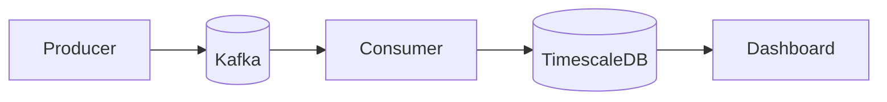

# Fleet Data Pipeline — Self-Driving Metrics

**Author:** Sai Santhosh V C  
**Repository:** [https://github.com/Sai-Santhosh/data-pipeline-for-autonomous-vehicles](https://github.com/Sai-Santhosh/data-pipeline-for-autonomous-vehicles)  
**License:** MIT (see [LICENSE](LICENSE))

Real-time data pipeline for mining fleet data and measuring **Self-Driving performance**: ingestion from simulated vehicles, stream processing with Kafka, time-series storage in TimescaleDB, and interactive metrics dashboards. Aligned with data engineering for autonomous vehicle fleet analytics.

---

## Architecture

End-to-end flow: **Ingestion → Kafka → Processing → TimescaleDB → Visualization**.

```
┌─────────────┐     ┌─────────────┐     ┌──────────────┐     ┌─────────────┐     ┌─────────────────┐
│  Producer   │────▶│   Kafka     │────▶│   Consumer   │────▶│ TimescaleDB │────▶│ Streamlit       │
│ (telemetry, │     │ (3 topics)  │     │ (alerts +    │     │ (hypertables)│     │ Dashboard       │
│  perception,│     │             │     │  batch write)│     │              │     │ (Self-Driving   │
│  events)    │     │             │     │              │     │              │     │  metrics)       │
└─────────────┘     └─────────────┘     └──────────────┘     └─────────────┘     └─────────────────┘
```

### Architecture diagram (Mermaid)



Detailed diagrams and component descriptions: [docs/architecture.md](docs/architecture.md).

---

## Features

- **Fleet telemetry**: Speed, location, battery, autopilot state, odometer, trip start/destination.
- **Perception events**: Object class, distance, speed, direction, confidence (for Self-Driving metrics).
- **Driving events**: Interventions, disengagements, lane change, hard brake.
- **Alerts**: Speed violation, low battery, collision risk (from stream processing).
- **Self-Driving metrics**: Interventions per vehicle, **miles (km) per intervention**, perception summaries, latest alerts.
- **Dashboard**: Real-time KPIs, speed gauge, battery, map, alerts, intervention and perception charts.

---

## Installation

### Prerequisites

- Python 3.10+
- Docker and Docker Compose
- Git

### Clone and setup

```bash
git clone https://github.com/Sai-Santhosh/data-pipeline-for-autonomous-vehicles.git
cd data-pipeline-for-autonomous-vehicles
# If this repo is inside another folder (e.g. new_tesla):
# cd new_tesla
```

### Python environment

```bash
python -m venv .venv
# Windows:
.venv\Scripts\activate
# macOS/Linux:
# source .venv/bin/activate
pip install -r requirements.txt
```

### Start infrastructure (Kafka + TimescaleDB)

```bash
docker-compose up -d
```

Wait for containers to be healthy. TimescaleDB runs the schema in `sql/01_schema.sql` on first start (via `docker-entrypoint-initdb.d`).

### Create Kafka topics

**Linux/macOS:**

```bash
chmod +x scripts/create_topics.sh
./scripts/create_topics.sh
```

**Windows (PowerShell):**

```powershell
.\scripts\create_topics.ps1
```

Or manually with Docker (adjust path if your Kafka image differs):

```bash
docker exec -it kafka /opt/bitnami/kafka/bin/kafka-topics.sh --create --if-not-exists --bootstrap-server localhost:9092 --topic vehicle_telemetry --partitions 3 --replication-factor 1
docker exec -it kafka /opt/bitnami/kafka/bin/kafka-topics.sh --create --if-not-exists --bootstrap-server localhost:9092 --topic perception_events --partitions 3 --replication-factor 1
docker exec -it kafka /opt/bitnami/kafka/bin/kafka-topics.sh --create --if-not-exists --bootstrap-server localhost:9092 --topic driving_events --partitions 3 --replication-factor 1
```

### Verify setup

Run the verify script to check config, DB connectivity, Kafka, topics, and Python dependencies:

```bash
python scripts/verify.py
```

Fix any reported issues (e.g. install deps with `pip install -r requirements.txt`, start Docker, create topics) and run again.

### Quickstart (one-shot)

To start infrastructure, create topics, and run verify in one go:

**Windows (PowerShell):**

```powershell
.\scripts\quickstart.ps1
```

**Linux/macOS:**

```bash
chmod +x scripts/quickstart.sh scripts/create_topics.sh
./scripts/quickstart.sh
```

Then start the consumer, producer, and dashboard in separate terminals (see below).

---

## Running the pipeline

1. **Start the consumer** (writes Kafka → TimescaleDB):

   ```bash
   python scripts/run_consumer.py
   ```

2. **Start the producer** (streams data to Kafka):

   ```bash
   # Live streaming (Ctrl+C to stop)
   python scripts/run_producer.py live
   # Or generate 50 batches per vehicle then exit
   python scripts/run_producer.py 50
   ```

3. **Open the dashboard**:

   ```bash
   python scripts/run_dashboard.py
   # Or:
   streamlit run src/visualization/dashboard.py
   ```

   Open [http://localhost:8501](http://localhost:8501).

---

## Project structure

```
new_tesla/
├── config/
│   ├── settings.yaml      # Kafka, TimescaleDB, metrics thresholds
│   └── __init__.py        # load_config()
├── docs/
│   └── architecture.md    # Architecture and Mermaid diagrams
├── notebooks/
│   ├── 01_data_understanding.ipynb
│   ├── 02_etl_training.ipynb
│   ├── 03_metrics_definitions.ipynb
│   └── 04_visualization_training.ipynb
├── results/               # Optional exports and screenshots
├── scripts/
│   ├── create_topics.sh   # Create Kafka topics (bash)
│   ├── create_topics.ps1  # Create Kafka topics (PowerShell)
│   ├── quickstart.sh      # One-shot: Docker + topics + verify (bash)
│   ├── quickstart.ps1     # One-shot: Docker + topics + verify (PowerShell)
│   ├── verify.py          # Verify config, DB, Kafka, topics, deps
│   ├── export_results.py  # Export metrics to CSV in results/
│   ├── run_producer.py
│   ├── run_consumer.py
│   └── run_dashboard.py
├── sql/
│   └── 01_schema.sql      # TimescaleDB hypertables
├── src/
│   ├── ingestion/
│   │   └── producer.py    # Kafka producer (telemetry, perception, events)
│   ├── processing/
│   │   └── consumer.py    # Kafka consumer → TimescaleDB + alerts
│   ├── storage/
│   │   └── db.py          # DB connection and insert helpers
│   ├── metrics/
│   │   └── queries.py     # Self-Driving metric queries
│   └── visualization/
│       └── dashboard.py   # Streamlit dashboard
├── docker-compose.yml
├── requirements.txt
├── LICENSE                # MIT, Sai Santhosh V C 2026
└── README.md
```

---

## Configuration

Edit `config/settings.yaml` to change:

- **Kafka**: `bootstrap_servers`, topic names
- **TimescaleDB**: host, port, database, user, password
- **Metrics**: battery threshold (%), speed limit (km/h), collision risk distance (m)
- **Streamlit**: port, refresh interval (seconds)

Environment overrides: `KAFKA_BOOTSTRAP_SERVERS`, `TIMESCALE_HOST`, `TIMESCALE_PORT`, `TIMESCALE_DB`, `TIMESCALE_USER`, `TIMESCALE_PASSWORD`. Copy `.env.example` to `.env` and set values; `python-dotenv` loads `.env` from the project root automatically.

---

## Notebooks

| Notebook | Purpose |
|----------|---------|
| **01_data_understanding** | Explore schema and sample data (telemetry, perception, events, alerts) |
| **02_etl_training** | ETL flow: generate records, write to DB |
| **03_metrics_definitions** | Self-Driving metrics: interventions, km per intervention, perception, alerts |
| **04_visualization_training** | Recreate dashboard charts (speed gauge, bars, tables) |

Run from repo root so that `sys.path` includes the project. Jupyter will use the project root as working directory if you start it from `new_tesla/`.

---

## Self-Driving metrics (summary)

- **Intervention / disengagement counts** per vehicle and time window
- **Km per intervention**: distance driven divided by number of interventions (higher is better)
- **Speed violations** and **low battery** alerts from telemetry
- **Collision risk** alerts from perception (close, fast-moving objects)
- **Perception summary**: detection counts by object class (car, pedestrian, cyclist, etc.)

---

## License

MIT License. Copyright (c) 2026 Sai Santhosh V C. See [LICENSE](LICENSE).
