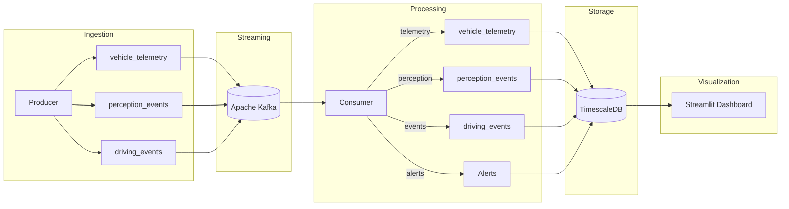
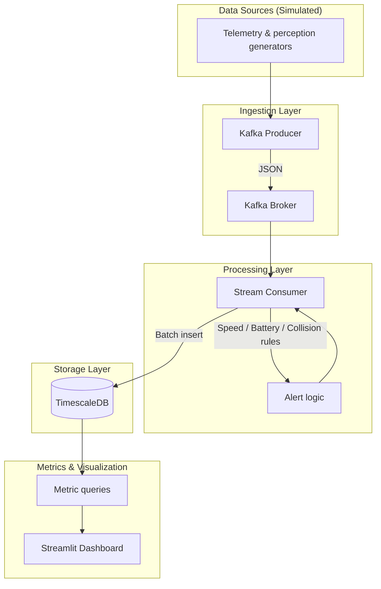

# Fleet Data Pipeline — Architecture

## Overview

This pipeline implements a **real-time data pipeline for fleet data and Self-Driving metrics**, aligned with use cases such as mining data from vehicles, measuring Self-Driving performance, and turning metrics into actionable insights.

## High-Level Architecture

## Component Diagram

## Data Flow

1. **Producer** (Python): Generates vehicle telemetry (speed, location, battery, autopilot state), perception events (object class, distance, speed), and driving events (intervention, disengagement). Publishes to Kafka topics.

2. **Kafka**: Buffers streams per topic; enables multiple consumers and replay.

3. **Consumer** (Python): Consumes all three topics; applies rules (speed violation, low battery, collision risk); writes telemetry, perception, driving events to TimescaleDB; writes alerts to `alerts` table.

4. **TimescaleDB**: Hypertables for time-series; supports efficient time-range and vehicle_id filters.

5. **Dashboard**: Reads from TimescaleDB via metric queries; displays KPIs, latest telemetry, alerts, interventions, miles-per-intervention, perception summaries.

## Self-Driving Metrics

| Metric | Description | Source |
|--------|-------------|--------|
| **Intervention count** | Driver takeover events | `driving_events` (event_type = intervention) |
| **Disengagement count** | Autopilot off events | `driving_events` (event_type = disengagement) |
| **Km per intervention** | Distance driven / interventions per vehicle | `vehicle_telemetry` (odometer) + `driving_events` |
| **Speed violation** | Telemetry over speed limit | `vehicle_telemetry`, `alerts` |
| **Collision risk** | Close, fast-moving object | `perception_events`, `alerts` |

## Technology Stack

- **Python 3.10+**: Producer, consumer, metrics, dashboard, notebooks
- **Apache Kafka**: Message broker for telemetry, perception, driving events
- **TimescaleDB (PostgreSQL)**: Time-series storage
- **Streamlit**: Interactive dashboard
- **Docker Compose**: Kafka, Zookeeper, TimescaleDB

## Deployment (Local)

- Run `docker-compose up -d` for Kafka and TimescaleDB.
- Apply schema: `sql/01_schema.sql` runs automatically via Docker init (or run manually).
- Create topics: `scripts/create_topics.sh` or `create_topics.ps1`.
- Run producer: `python scripts/run_producer.py live` (or `50` for 50 batches).
- Run consumer: `python scripts/run_consumer.py`.
- Run dashboard: `python scripts/run_dashboard.py` or `streamlit run src/visualization/dashboard.py`.

## Scaling Notes

- **Producer**: Can run multiple instances with distinct vehicle ID ranges.
- **Consumer**: Use Kafka consumer groups for parallelism; ensure idempotent or partitioned writes to avoid duplicates.
- **TimescaleDB**: Use chunk retention and compression for long-term storage; add read replicas for heavy dashboard load.
